# PARCIAL DE DESARROLLO WEB

## Segundo corte

Diagrama

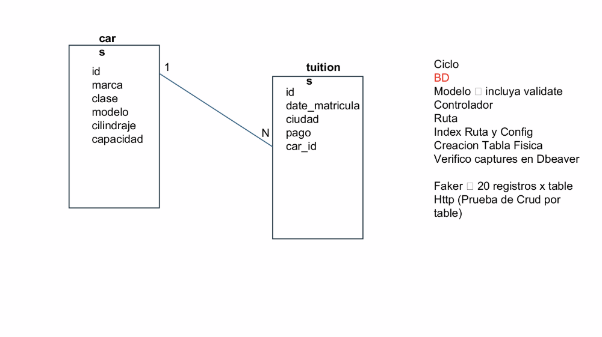

Creando el modelo

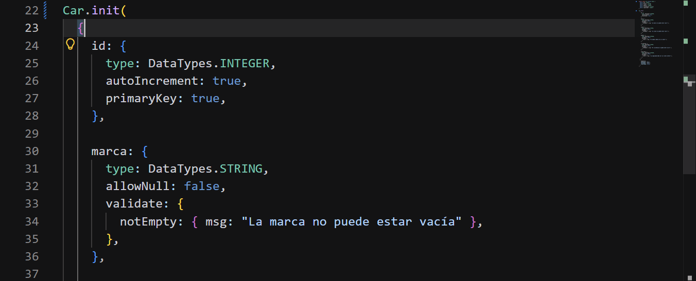](images/clipboard-3715049525.png)

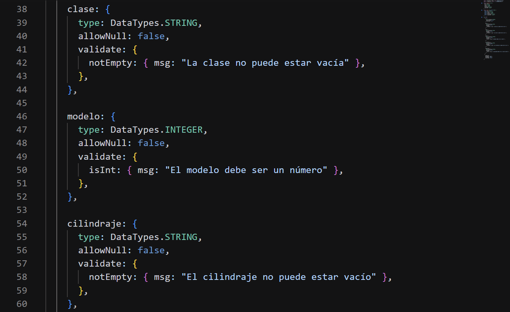

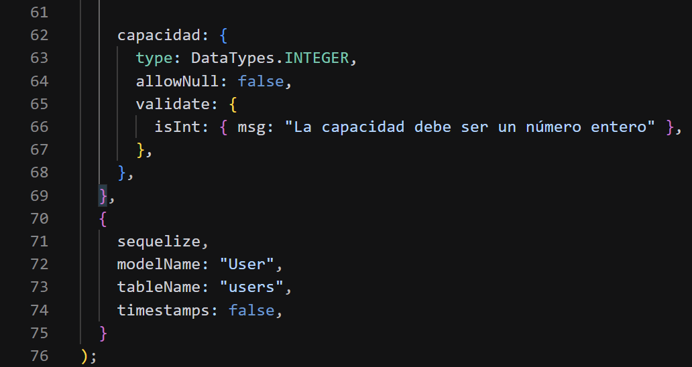

<https://github.com/ijxrgent/partial_2/commit/1337a5899bb2bad2d6da41dbf138d1be528d8edc>

Controlador

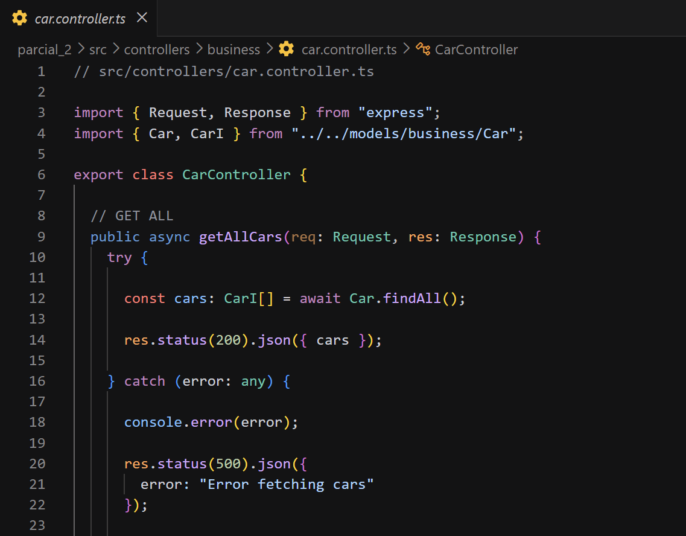

<https://github.com/ijxrgent/partial_2/commit/75e3fdd748445cc44cd6525e4c90ff01c497a31a>

Ahora creo la ruta

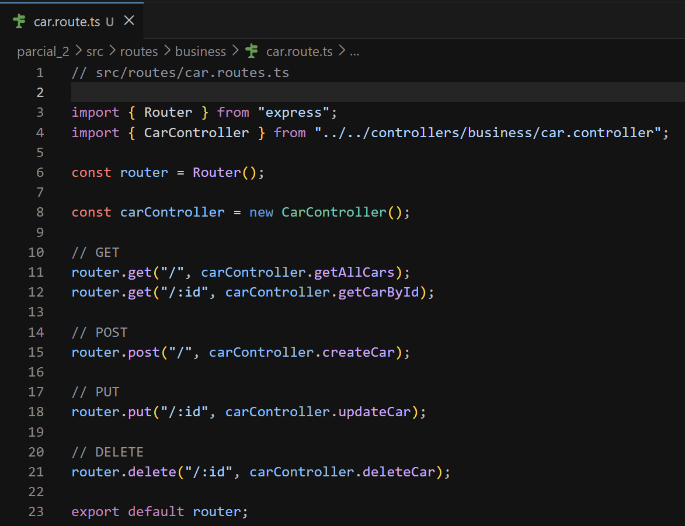

<https://github.com/ijxrgent/partial_2/commit/533c235bf1f3a3309dc06b8713a9d7499e50e14d>

Ahora creo el modelo de Tuition

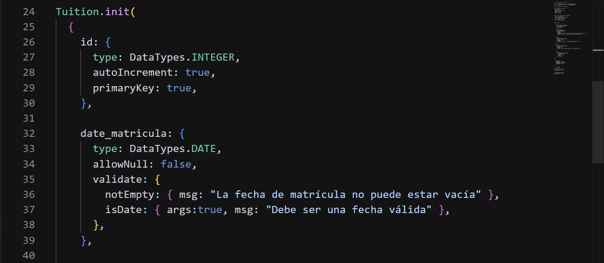](images/clipboard-1542729316.png)

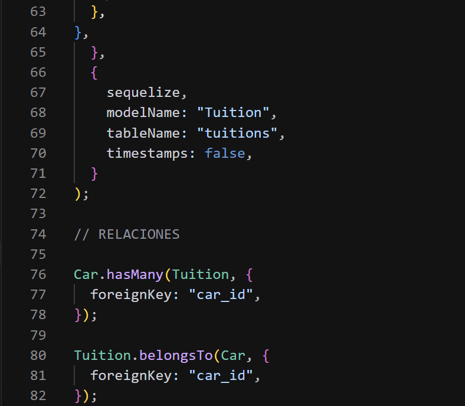](images/clipboard-185741528.png)

<https://github.com/ijxrgent/partial_2/commit/2c0f60a315ca8f6c7b46a6cc26a0452bc4e9dce5>

Controlador del modelo Tuition

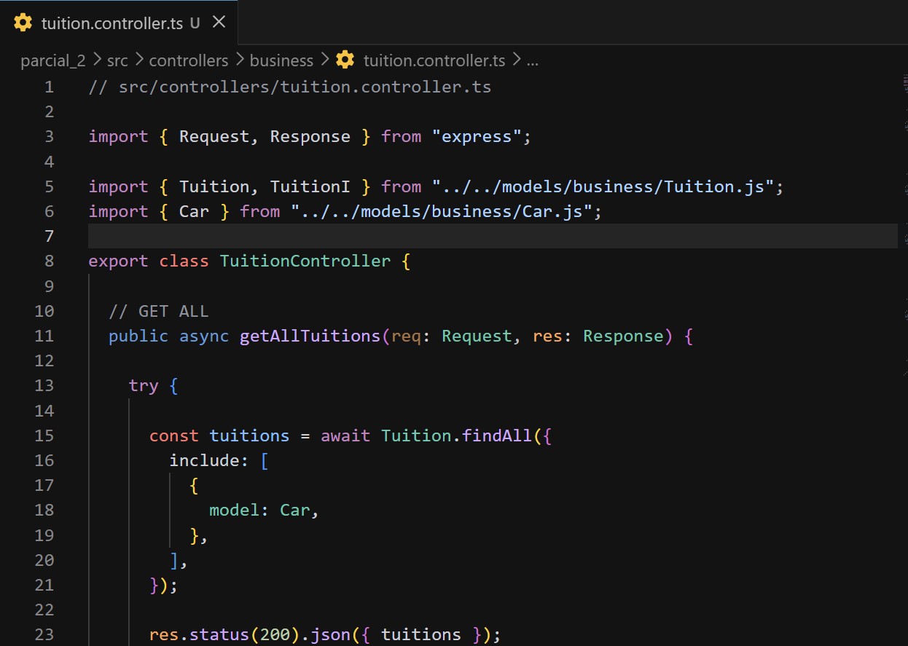

<https://github.com/ijxrgent/partial_2/commit/9e22779a71db52b66c2794e28f138f345967f7bb>

Rutas

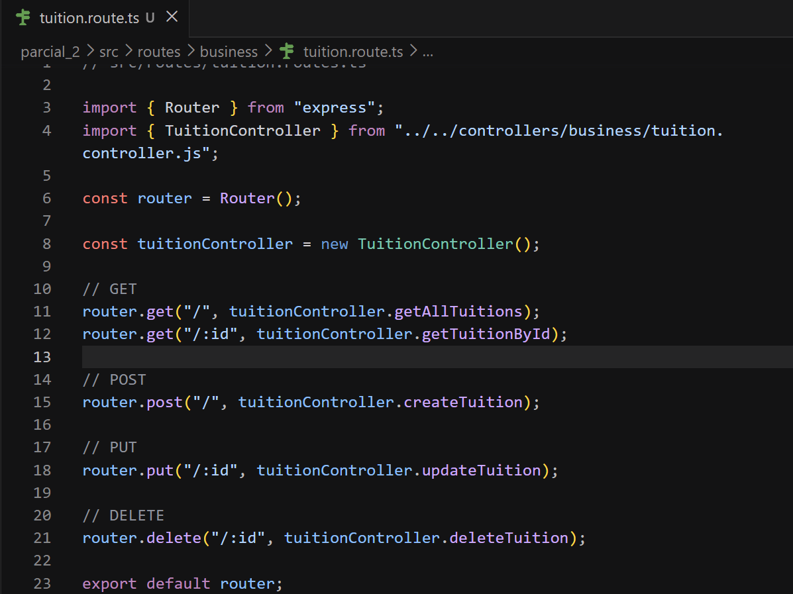

creando el faker de Car

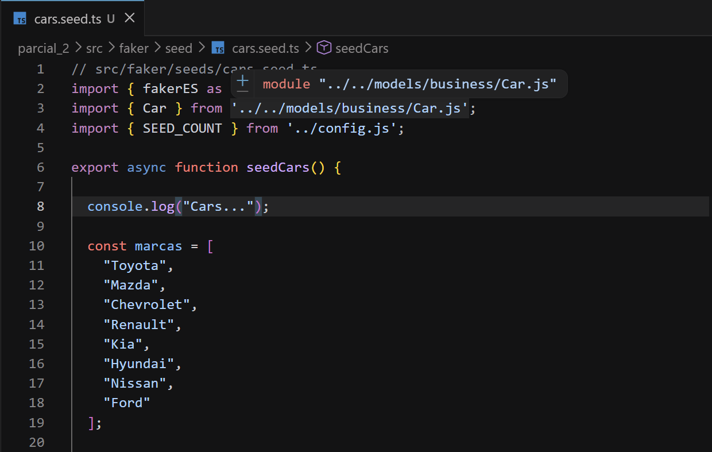

Creando el faker de Tuition

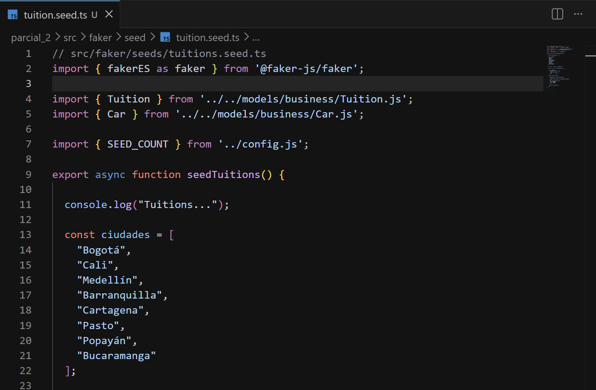

Prueba de que funcionó

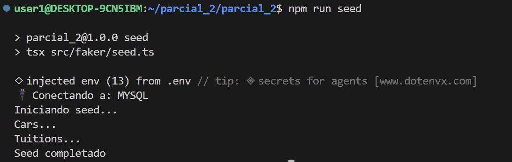

Evidencia

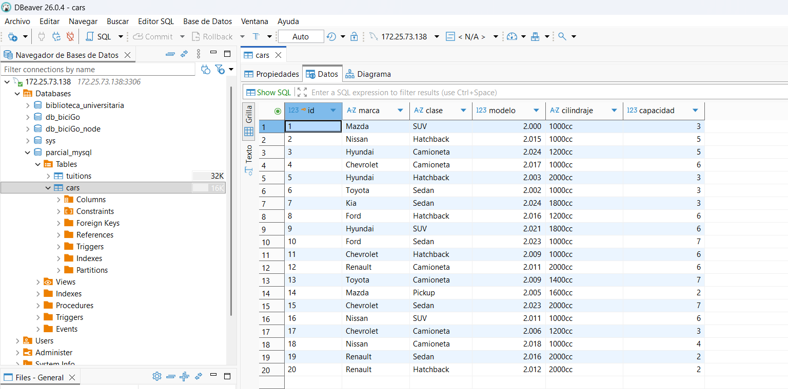

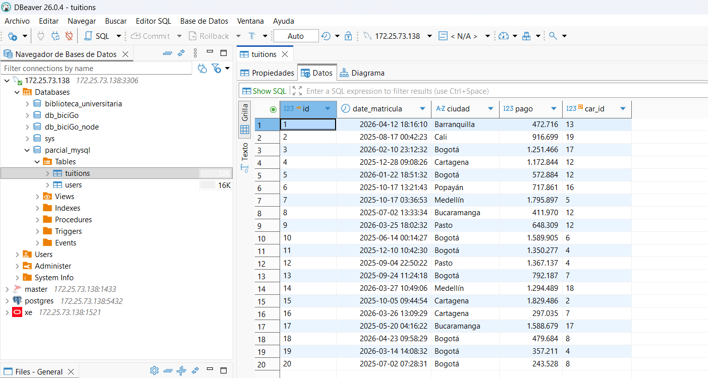

<https://github.com/ijxrgent/partial_2/commit/c7267fa9acecff3727b248797222752b9f3bb49c>

Creando los archivo http

cars.http

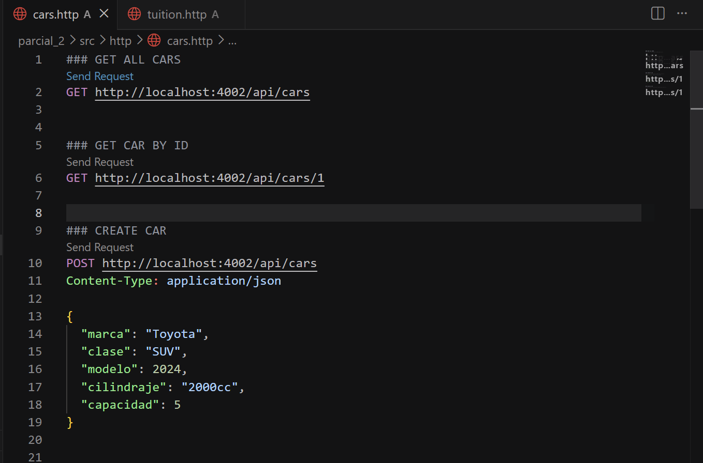

tuition.http

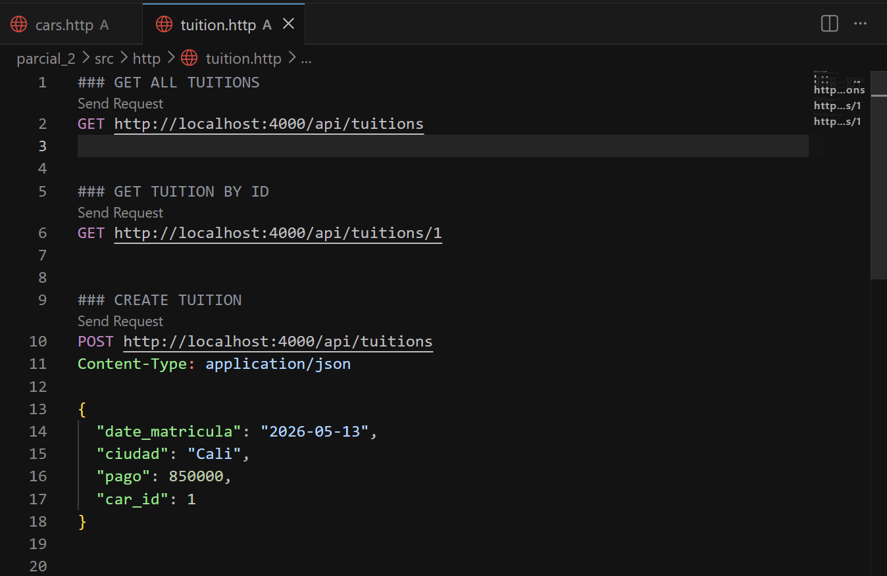

# Declaración de uso de Inteligencia Artificial

Para el desarrollo de este proyecto se utilizó Inteligencia Artificial como herramienta de apoyo en el proceso de aprendizaje, análisis y programación. La IA fue empleada principalmente para:
- Orientación en la estructura del proyecto.

- Generación de ejemplos de código en TypeScript, Express y Sequelize.

- Resolución de errores de configuración y conexión.

- Apoyo en la creación de modelos, controladores y rutas.

- Generación de datos de prueba con Faker.

- Explicaciones sobre integración de bases de datos como MySQL y PostgreSQL.

Todo el código fue revisado, adaptado y probado manualmente antes de ser implementado en el proyecto final. La utilización de IA tuvo un propósito educativo y de asistencia técnica durante el desarrollo de la aplicación.
